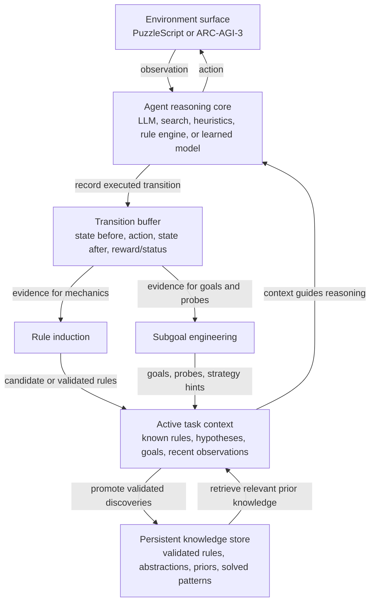

# ARC-AGI Architecture Pipeline View

This note is a companion to `arc-agi-architecture.svg`. The SVG uses the richer layered view. This file keeps the simpler pipeline view available when the intended data flow needs to be explained quickly.

## Linear Pipeline

## Important Distinctions

The reasoning core is intentionally not named "LLM reasoning core". An LLM can be one implementation mechanism, but the architecture should stay open to search, heuristics, learned models, and explicit rule engines.

The active task context and persistent knowledge store are linked, but they are not the same object. The active context is the working state for the current environment: known rules, current hypotheses, recent observations, and current goals. The persistent store is longer-lived memory: validated rules, reusable abstractions, prior solved patterns, and cross-task knowledge.

The transition buffer is the shared evidence source for both rule induction and subgoal engineering. Rule induction uses transitions to infer mechanics. Subgoal engineering uses the same evidence to create useful probes, local objectives, and strategy hints.

The target architecture does not require periodic refinement. The current implementation may batch some inference work, but the diagram should leave the trigger open: after every transition, after meaningful novelty, when confidence changes, or by another policy selected later.
